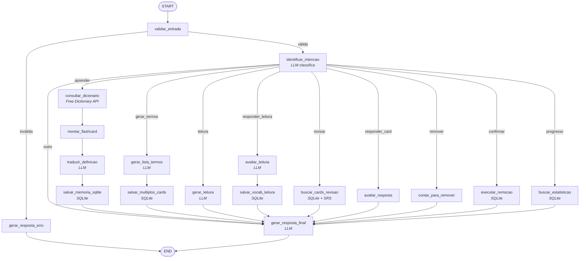

# Tutor de Inglês — Agente com LangGraph

Mini-Projeto Avaliativo · Módulo 2 · IA para Desenvolvedores (SCTEC)
Autor: **Felipe Feyh**

---

## Descrição do problema

Aprender vocabulário em inglês de forma consistente é difícil sem método. A técnica
mais eficaz para memorização é a **repetição espaçada (SRS)** — o mesmo princípio do
Anki: cada palavra volta a ser revisada em intervalos crescentes, e reaparece cedo
quando você erra. Porém, ferramentas tradicionais de flashcards não geram conteúdo
sozinhas nem avaliam respostas de forma inteligente: o aluno precisa montar cada card
manualmente e a correção é por texto exato.

Este projeto resolve isso combinando um **agente de IA** (que entende linguagem
natural, consulta dicionários reais, gera conteúdo e avalia respostas por significado)
com um **sistema de flashcards com repetição espaçada persistido em banco de dados**.

## Objetivo do agente

Automatizar o ciclo completo de estudo de vocabulário em inglês:

- **Entrada:** texto livre do aluno em português (ex: `quero aprender reliable`,
  `termos sobre java`, `revisar`, `texto sobre viagem`, `apague todos os cards`).
- **Processamento:** o agente valida a entrada, identifica a intenção, aciona as
  ferramentas necessárias (dicionário/SQLite) e mantém o contexto da sessão.
- **Saída:** resposta estruturada em português — card salvo com definição/exemplo/
  sinônimos/pronúncia, lista de termos, texto de leitura com perguntas, feedback de
  revisão, estatísticas de progresso ou confirmação de remoção.

## Por que é um agente

Não é um chatbot passivo: ele **decide autonomamente** qual caminho seguir com base
na intenção do usuário (roteamento condicional), **usa ferramentas** para agir no
mundo real (API externa e banco de dados), **mantém estado/memória** ao longo da
execução e entre turnos, e **produz saídas estruturadas e verificáveis**.

## Fluxo com LangGraph (StateGraph)

O agente é um `StateGraph` com estado tipado (`EstadoAgente`, um `TypedDict`), nós
(funções puras) e edges condicionais para o roteamento por intenção.



Representação textual do mesmo fluxo:

```
START
  → validar_entrada                      (validação da entrada)
  → identificar_intencao                 (LLM classifica a intenção)
  → [roteamento condicional por intenção]
      ├─ aprender          → consultar_dicionario → montar_flashcard
      │                      → traduzir_definicao → salvar_memoria_sqlite
      ├─ gerar_termos      → gerar_lista_termos → salvar_multiplos_cards
      ├─ leitura           → gerar_leitura
      ├─ responder_leitura → avaliar_leitura → salvar_vocab_leitura
      ├─ revisar           → buscar_cards_revisao
      ├─ responder_card    → avaliar_resposta
      ├─ remover           → contar_para_remover      (pede confirmação)
      ├─ confirmar_remocao → executar_remocao         (após "confirmar")
      └─ progresso         → buscar_estatisticas
  → gerar_resposta_final                 (resposta estruturada)
  → END
(entrada inválida → gerar_resposta_erro → END)
```

## Ferramentas integradas

| Ferramenta | Tipo | Papel no agente |
|---|---|---|
| **Free Dictionary API** (`dictionaryapi.dev`) | Chamada a API externa (HTTP) | Fornece definição, exemplo, sinônimos, IPA e áudio reais em inglês. Usada nos nós `consultar_dicionario` |
| **SQLite** (`dados/ingles.db`) | Consulta/escrita em banco local | Persiste os flashcards e o agendamento SRS. Usada nos nós de salvar, revisar, estatísticas e remover |

Os servidores das ferramentas ficam em `servers/` e foram escritos como servidores
MCP (Model Context Protocol) — conteúdo estudado nas semanas iniciais do módulo. No
agente LangGraph, suas funções são importadas e usadas diretamente pelos nós.

## Contexto e memória

- **Curto prazo:** o estado compartilhado do grafo carrega os dados entre os nós de
  uma execução. Entre turnos, o loop principal mantém a **fila de revisão**, o
  **contexto de leitura** (texto aguardando respostas) e a **confirmação de remoção**.
- **Longo prazo:** o banco SQLite guarda os cards, datas de revisão, intervalos SRS,
  acertos/erros e o tema — persistindo entre execuções.

## Validação e segurança

- Nó `validar_entrada`: rejeita entrada vazia ou acima de 500 caracteres antes de
  qualquer processamento.
- Validações nas ferramentas: palavra/significado obrigatórios ao criar card; 404 do
  dicionário tratado com mensagem amigável; falhas de rede/JSON não derrubam o agente.
- **Operação destrutiva com confirmação:** remover cards exige um "confirmar" explícito.
- **Segurança de chaves:** a `GROQ_API_KEY` fica no `.env` (não versionado). O
  repositório traz apenas `.env.example` com os nomes das variáveis, sem valores. O
  `.gitignore` ignora `.env`, `.venv/`, `dados/` e `__pycache__/`.

## Como executar

### Pré-requisitos
- Python 3.10+
- Chave de API gratuita do Groq: https://console.groq.com/keys

### Instalação

```bash
git clone https://github.com/Felipe-Feyh/Tutor-Ingles-Mini-Projeto-avaliativo.git
cd Tutor-Ingles-Mini-Projeto-avaliativo

python -m venv .venv
# Windows:
.\.venv\Scripts\activate
# Linux/Mac:
# source .venv/bin/activate

pip install -r requirements.txt
```

### Configuração

```bash
# copie o exemplo e preencha sua chave
copy .env.example .env      # Windows
# cp .env.example .env      # Linux/Mac
# edite o .env e coloque sua GROQ_API_KEY
```

### Execução

```bash
python agente_langgraph.py
```

Comandos disponíveis (linguagem natural):

| Comando | O que faz |
|---|---|
| `aprender <palavra>` | Cria um card com definição, exemplo, sinônimos, IPA e áudio reais |
| `termos sobre <tema>` | Gera e salva vários cards de um tema (ex: `termos sobre java`) |
| `texto sobre <tema>` | Gera um texto em inglês para leitura, com perguntas |
| `revisar` / `revisar sobre <tema>` | Sessão de flashcards com repetição espaçada (filtrável por tema) |
| `progresso` | Mostra estatísticas de estudo |
| `remover cards de <tema>` / `apague todos os cards` | Remove cards (com confirmação) |
| `sair` | Encerra |

## Exemplo de entrada e saída

**Entrada:**
```
quero aprender deadline
```

**Saída:**
```
🎉 Card salvo com sucesso!
Palavra: deadline
Definição (inglês): A time limit in the form of a date on or before which
something must be completed.
Exemplo: I must hand in my essay before the deadline.
Sinônimos: due date, time limit
Pronúncia (IPA): /ˈdɛdˌlaɪn/
Áudio: https://api.dictionaryapi.dev/media/pronunciations/en/deadline-us.mp3
Tradução: prazo, data limite.
```

**Entrada (sessão de revisão):**
```
revisar
→ Vamos começar! Você tem 3 cards.
   O que significa deadline?
viagem            (resposta do aluno ao card mostrado)
→ ✅ ou ❌ com o significado correto, e o próximo card é apresentado automaticamente
```

## Estrutura do projeto

```
├── agente_langgraph.py          # Agente principal (StateGraph)
├── llm_config.py                # Configuração do LLM (Groq/Gemini) via .env
├── servers/
│   ├── ingles_server.py         # Flashcards + repetição espaçada (SQLite)
│   └── dicionario_en_server.py  # Dicionário de inglês (Free Dictionary API)
├── docs/
│   ├── prompts.md               # Registro dos principais prompts
│   └── apresentacao.md          # Conteúdo dos 2 slides
├── dados/                       # Banco SQLite (criado no 1º uso, não versionado)
├── requirements.txt
├── .env.example                 # Nomes das variáveis, sem valores
├── .gitignore
└── README.md
```

## Principais decisões tomadas

1. **LangGraph com StateGraph** para tornar o fluxo explícito, com nós e roteamento
   condicional por intenção — em vez de um loop de `if/else`.
2. **Repetição espaçada (SM-2 simplificado)** no servidor SQLite: o agendamento é
   determinístico e fica fora do LLM (que não é confiável para isso).
3. **Free Dictionary API** para dar *grounding*: o agente cita dados reais em vez de
   inventar definições/pronúncia.
4. **Cards com tema** para permitir gerar, revisar e remover por assunto.
5. **Sessões mantidas no loop principal** (revisão contínua, leitura em 2 turnos,
   confirmação de remoção) como memória de curto prazo entre turnos.
6. **Modelo Groq `openai/gpt-oss-20b`** (bom em seguir instruções, com cota separada);
   pode ser trocado por `openai/gpt-oss-120b` no `.env` para maior qualidade.

## Limitações da solução

- A avaliação da resposta na revisão é uma comparação textual tolerante (substring),
  não uma checagem semântica profunda — respostas muito diferentes da forma salva
  podem ser marcadas como erradas.
- O histórico de **conversa** não persiste entre execuções (apenas os flashcards, no
  SQLite). A cada execução o contexto de diálogo recomeça.
- Depende de conexão com a internet (Free Dictionary API e LLM via Groq).
- O free tier do Groq tem limite diário de tokens; se estourar, troque o `GROQ_MODEL`
  no `.env` ou aguarde o reset.
- A geração de termos/textos vem do LLM e pode, ocasionalmente, trazer um termo menos
  relevante ao tema.
